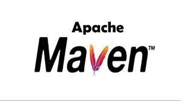

<div align="center">
<h1 align="center">
<br>
Amazon Login, Product Search and Add Product to Cart Tests
</h1>
<h3 align="center">🚀 Developed with the software and tools below.</h3>
<p align="center">



</div>

---

## 📚 Table of Contents
- [📚 Table of Contents](#-table-of-contents)
- [📍 Overview](#-introdcution)
- [🔮 Features](#-features)
- [🏎💨 Getting Started](#-getting-started)
---


## 📍 Overview

This Test project is focused on login function on wwww.amazon.com with chrome driver. Through the project's code scripts, users are able to perform automated checks for website login function, search product and add product to chart  funtions.  The project is a great example of how to automate basic website functions with selenium.

---

## 🔮 Features

### Distinctive Features

**waitUntilElementShowCss and waitUntilElementShowXpath** = This codes scripts are force to wait the web element before jump to next step while test running.


**waitUntilElementToBeClickableCss and waitUntilTheElementCanBeClickableXpath** = This codes scripts are force to wait the element to be clickable before jump to next step while test running.

**clickButtonCss and clickButtonXpath** = This codes scripts allows us to click on an website element of during testing with selenium.

**typeInBlankCss and typeInBlankXpath** = This code scripts  allows us to write in the blanks field on the page.

**hitKeyboardButtonXpath** = This code scripts  allows us to take action as if we were pressing a keyboard key.

## 🚀 Getting Started

### 💻 Installation

1. Clone the InstagramLoginTestAutomation repository:
```sh
git clone https://github.com/abdullahcancoban/AmazonLogin-ProductSearch-AddProductToCart
```
2. Install the dependencies:
```sh
install JDK 11 or higher, ApacheMaven Api and Selenium Java Maven Repository
```


